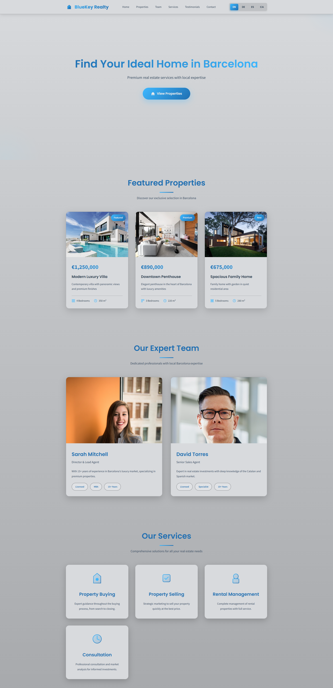

# 🏠 BlueKey Realty - Premium Real Estate Website

A modern, multilingual real estate website for luxury properties in Barcelona, featuring a sophisticated grey gradient design with blue accents.

## ✨ Features

- **Multilingual Support**: English, German, Spanish, and Catalan
- **Responsive Design**: Fully optimized for all devices
- **Smooth Animations**: Professional scroll animations and transitions
- **Property Showcase**: Featured luxury properties with detailed information
- **Team Section**: Professional real estate agent profiles
- **Contact Form**: Integrated contact system with Google Maps
- **Modern UI/UX**: Progressive grey gradient design with excellent visual contrast

## 🌐 Live Demo

Visit the live website: [bluekey-realty.vercel.app](https://bluekey-realty.vercel.app/)

## 🎨 Design Highlights

- Progressive background darkening for visual depth
- Consistent bright card design for optimal readability
- Blue gradient accents throughout
- Smooth hover effects and transitions
- Professional typography with Poppins and Source Sans Pro

## 🛠️ Technologies

- Pure HTML5
- CSS3 with custom properties
- Vanilla JavaScript
- Google Fonts
- Google Maps integration
- Responsive Grid & Flexbox layouts

## 📸 More Screenshots

[View All Screenshots →](screenshots/)

## 📝 License

This project is designed and developed as a custom real estate website solution.

---

**Built with ❤️ for luxury real estate in Barcelona**
